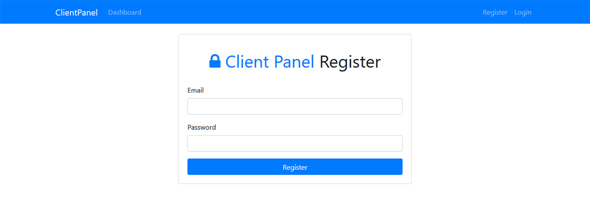
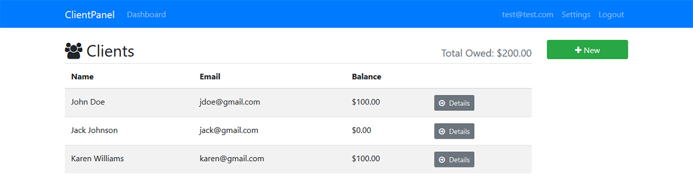
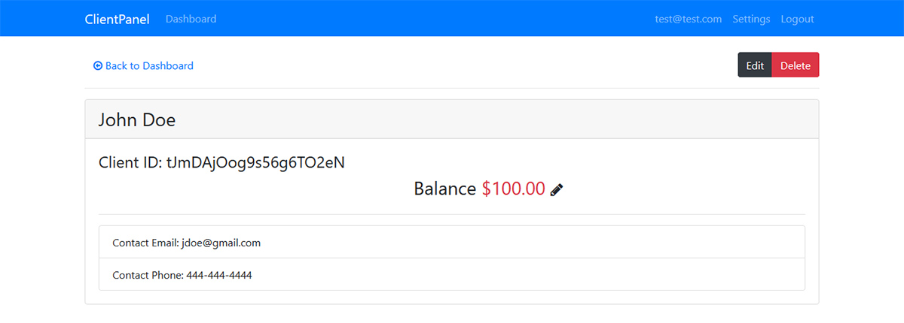

# ClientPanel

Client panel app created with [Angular CLI](https://github.com/angular/angular-cli) version 8.1.2, Firebase and Bootstrap 4. 

## Features 

Admin register/login.
Client add, edit, delete.

## Installation & Usage

1. Clone the repository

2. Run `npm install`

3. Run `ng serve` for a dev server. Navigate to `http://localhost:4200/`.

## Build

Run `ng build` to build the project. The build artifacts will be stored in the `dist/` directory. Use the `--prod` flag for a production build.

